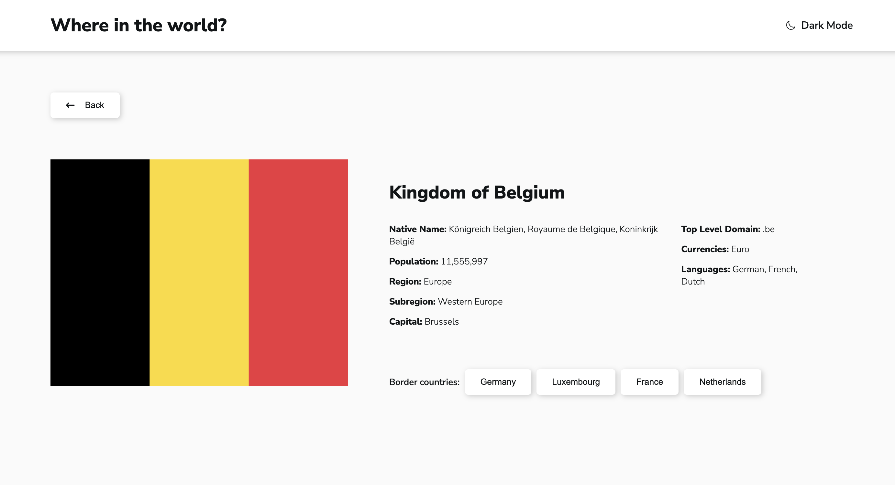

# Frontend Mentor - REST Countries API with color theme switcher solution

This is a solution to the [REST Countries API with color theme switcher challenge on Frontend Mentor](https://www.frontendmentor.io/challenges/rest-countries-api-with-color-theme-switcher-5cacc469fec04111f7b848ca). Frontend Mentor challenges help you improve your coding skills by building realistic projects.

### The challenge

Users should be able to:

- See all countries from the API on the homepage
- Search for a country using an `input` field
- Filter countries by region
- Click on a country to see more detailed information on a separate page
- Click through to the border countries on the detail page
- Toggle the color scheme between light and dark mode *(optional)*

### Screenshot

### Links

- Solution URL: [Add solution URL here](https://www.frontendmentor.io/solutions/rest-countries-api-with-color-theme-switcher-BXgFyY0O8z)
- Live Site URL: [Add live site URL here](https://countries-xi-six.vercel.app)

### Built with

- React
- Typescript
- Redux Toolkit
- RTK Query
- React router
- Sass
- Axios
- Redux persist
- Eslint
- Prettier
